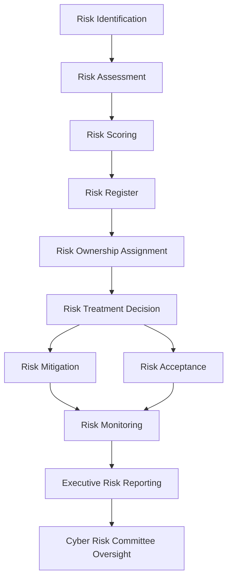

# Enterprise Cyber Risk Management Program

This repository provides a practical blueprint for designing and operating an enterprise Cyber Risk Management program.

Modern organizations face complex cyber threats across cloud platforms, SaaS environments, third-party services, and distributed infrastructure. Security leaders must be able to identify cyber risk, prioritize mitigation efforts, communicate exposure to executives, and maintain governance oversight across the enterprise.

This project demonstrates how a structured cyber risk management program can be designed, implemented, and governed.

---

## Program Architecture

This repository is organized to reflect the core operational components of a mature cyber risk management program.

Each section represents a critical capability required to identify, evaluate, govern, and report cybersecurity risk across the enterprise.

```text
Cyber Risk Management Program

├── Governance
│   ├── Risk Governance Model
│   ├── Cyber Risk Committee Charter
│   └── Risk Decision Authority Matrix
│
├── Risk Framework
│   ├── Risk Scoring Model
│   ├── Risk Lifecycle
│   └── Risk Register Template
│
├── Operations
│   ├── Risk Ownership Model
│   └── Risk Acceptance Process
│
└── Reporting
    └── Executive Cyber Risk Dashboard
```

---

## Cyber Risk Lifecycle Overview

The diagram below illustrates how cyber risks move through the enterprise risk management process, from identification through governance oversight and executive reporting.



---

## Program Objectives

The goal of this blueprint is to demonstrate how organizations can operationalize cyber risk management through clear governance, structured risk evaluation, and executive reporting.

Key objectives include:

- Establishing cyber risk governance  
- Creating a consistent risk scoring methodology  
- Defining ownership and accountability for risk decisions  
- Providing structured risk acceptance processes  
- Enabling executive-level cyber risk reporting  
- Maintaining visibility into enterprise cyber risk exposure  

---

## Core Program Components

### Governance

Defines how cyber risk decisions are reviewed, escalated, and approved across the organization.

Includes:

- Risk governance model  
- Cyber risk committee structure  
- Risk decision authority matrix  
- Executive oversight mechanisms  

---

### Risk Framework

Establishes consistent methods for identifying, scoring, and documenting cyber risks.

Includes:

- Risk identification framework  
- Risk scoring methodology  
- Cyber risk lifecycle  
- Enterprise risk register  

---

### Risk Operations

Describes how cyber risk decisions are managed operationally across security, engineering, and business stakeholders.

Includes:

- Risk ownership model  
- Risk acceptance workflow  
- Risk lifecycle management  
- Operational risk tracking  

---

### Risk Reporting

Provides structures for communicating cyber risk posture to executive leadership and governance bodies.

Includes:

- Executive cyber risk dashboard  
- Cyber risk metrics and KPIs  
- Risk trend reporting  
- Risk committee reporting  

---

## Why Cyber Risk Programs Matter

Cyber risk management is not only about identifying vulnerabilities.

It enables organizations to make informed business decisions about technology risk while maintaining transparency and accountability across leadership, engineering teams, and security organizations.

A mature cyber risk program ensures that risks are visible, prioritized, and managed consistently across the enterprise.

---

## Framework Alignment

This blueprint aligns with widely adopted cybersecurity and governance frameworks including:

- NIST Risk Management Framework (RMF)  
- ISO 27001 Information Security Management  
- COBIT Governance Practices  

These frameworks help organizations implement standardized security governance and risk management practices.

---

## Connect With Me

If you're interested in cybersecurity governance, enterprise risk management, or GRC program development, feel free to connect.

- LinkedIn  
  https://www.linkedin.com/in/neviarr/

- GitHub  
  https://github.com/neviarrawlinson

- Substack — *GRC Explained*  
  https://substack.com/@ctrlaltgrc

- Medium  
  https://medium.com/@neviarrawlinson

- Dev.to  
  https://dev.to/neviarrawlinson

I regularly share resources, projects, and insights related to cybersecurity governance, risk management, and compliance programs.
