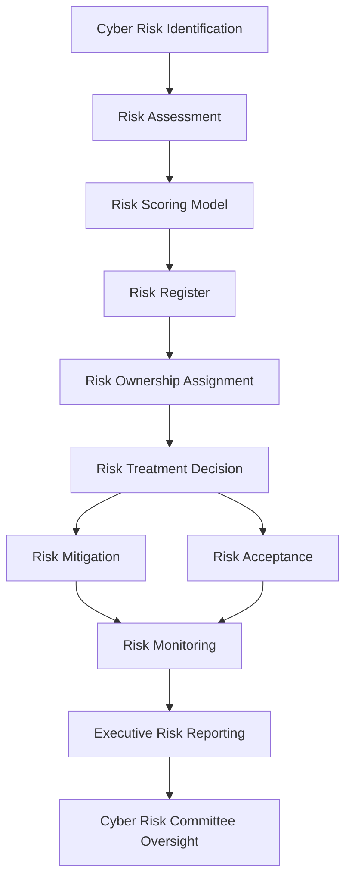

# Cyber Risk Management Program Architecture

The diagram below illustrates how the components of the cyber risk management program interact across governance, risk evaluation, operations, and executive reporting.


---

## Risk Lifecycle Flow

Cyber risks move through a structured lifecycle to ensure consistent evaluation and governance.

### 1. Risk Identification

Cyber risks may be identified through several sources including:

- Vulnerability management findings  
- Security assessments  
- Incident response investigations  
- Threat intelligence  
- Internal audits and compliance reviews  

Identified risks should be documented within the enterprise risk register.

---

### 2. Risk Assessment

Once identified, risks are evaluated to determine their likelihood and potential impact on the organization.

Assessment activities typically consider:

- Threat likelihood
- Business impact
- Existing security controls
- Exploitability of vulnerabilities

---

### 3. Risk Scoring

Risk scoring provides a consistent method for prioritizing risk remediation activities.

Most organizations evaluate risk using:

```
Risk Score = Likelihood × Impact
```

Risk scoring helps determine which risks require immediate mitigation and which may be managed through governance processes.

---

### 4. Risk Documentation

All identified risks should be documented in the enterprise risk register.

Typical risk register attributes include:

- Risk description
- Risk score
- Affected system or service
- Risk owner
- Treatment strategy
- Review date

Maintaining a centralized risk register ensures visibility across the organization.

---

### 5. Risk Ownership

Each documented risk must have a clearly assigned owner responsible for managing the risk.

Risk owners are typically:

- System owners
- Engineering leaders
- Infrastructure teams
- Application owners

Security teams advise on risk management but do not typically own the underlying business risk.

---

### 6. Risk Treatment Decision

Once evaluated, risks must be assigned a treatment strategy.

Common treatment options include:

| Treatment Strategy | Description |
|---|---|
| Mitigate | Implement controls to reduce risk |
| Accept | Formally accept the risk with leadership approval |
| Transfer | Transfer risk through contracts or insurance |
| Avoid | Eliminate the activity that creates the risk |

---

### 7. Risk Mitigation

When mitigation is chosen, security and engineering teams implement security controls designed to reduce risk exposure.

Examples include:

- Patching vulnerabilities
- Implementing access controls
- Improving monitoring capabilities
- Updating security configurations

---

### 8. Risk Acceptance

When mitigation is not immediately feasible, organizations may formally accept risk through a documented governance process.

Risk acceptance decisions should include:

- Defined expiration date
- Executive approval when required
- Periodic review cycles

---

### 9. Risk Monitoring

Risks must be continuously monitored until they are mitigated or formally closed.

Monitoring activities include:

- Risk review cycles
- Governance committee oversight
- Risk trend analysis
- Executive reporting

---

## Governance Oversight

Cyber risk governance ensures that leadership maintains visibility into enterprise cyber risk exposure.

Governance oversight may include:

- Cyber Risk Committee reviews
- Executive risk dashboards
- Risk decision authority structures
- Risk acceptance approvals

Governance processes ensure that cybersecurity risk decisions align with organizational risk tolerance.

---

## Executive Visibility

Executive leadership requires clear, concise insights into cyber risk posture.

Executive reporting typically focuses on:

- Critical and high cyber risks
- Risk remediation progress
- Accepted risks
- Risk trends over time

These insights help leaders prioritize investments in security and risk reduction.
